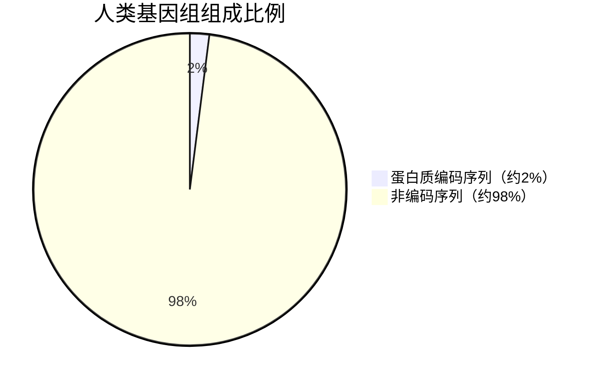
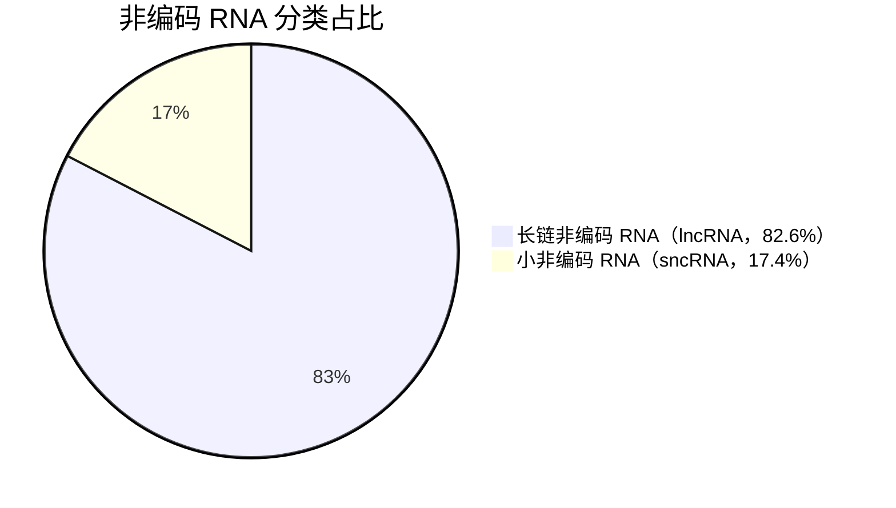

## 一、人类基因组的大小与基本组成

### 1.1 大小：约 31.6 亿个碱基对

人类核基因组包含约 **31.6 亿个 DNA 碱基对**（bp），分布在 22 对常染色体和 1 对性染色体上。需要特别注意的是，4 月 2 日西湖大学杨剑团队发布的研究表明，新构建的 1KCP 泛基因组中发现了约 4.053 亿个此前未记录的全新序列，占人类基因组的 13%，这意味着人类基因组的大小和复杂度仍在持续扩展。

### 1.2 基本组成：编码序列仅占 1.5–3%

人类基因组由编码序列和非编码序列两大部分组成。实际编码蛋白质的序列仅占基因组的 约 2%，其余 98% 左右均为非编码 DNA。

使用 mermaid 制图（它居然能安插到 markdown 里，太伟大了 markdown）

### 1.3 基因组组成的详细分类

在非编码序列中，可以进一步细分为多种功能元件：

| 组成分类 | 预估占比 | 主要功能/说明 |
|:---|:---|:---|
| **蛋白质编码序列** | 1.5–3% | 直接编码蛋白质的外显子区域 |
| **内含子** | ~25–30% | 基因内的非编码区，通过剪接被移除 |
| **重复序列（总体）** | ≥60% | 基因组中最主要的组成部分 |
| └ 转座子来源的散在重复序列 | ~45% | L1 占 ~17%、Alu 占 ~10% |
| └ 卫星 DNA（高度重复） | 8–10% | 集中于着丝粒和端粒区域 |
| └ 片段性重复 | ~6% | 长序列在染色体间的重复 |
| **调控元件** | 未完全量化 | 含增强子、启动子、沉默子等 |
| **非编码 RNA 基因** | ~2–3% | 转录但不翻译成蛋白质的 RNA |
| **假基因** | ~1–2% | 失去功能的基因残余 |
| **未表征序列** | 持续发现 | T2T-CHM13 等完整组装揭示了大量新区域 |

目前共识认为，人类蛋白质编码基因的数量约为 19,000–20,000 个，远低于早期估计的 10 万个。

---

## 二、非编码 RNA 的最新注释

### 2.1 GENCODE v49 统计

GENCODE 是人类基因组注释的权威项目，其最新版本 v49 于 2025 年 9 月 发布，以下为该版本的统计数据：

| 类别 | 数量 | 占非编码基因比例 |
|:---|:---|:---|
| 长链非编码 RNA (lncRNA) | 35,899 | 82.6% |
| 小非编码 RNA (sncRNA) | 7,563 | 17.4% |
| **非编码 RNA 基因合计** | **43,462** | 100% |
| 假基因 (pseudogenes) | 14,701 | — |
| └ 其中：processed pseudogenes | 10,638 | — |
| └ unprocessed pseudogenes | 3,536 | — |
| └ unitary pseudogenes | 290 | — |

*数据来源：GENCODE Release 49*

- 总基因数（含所有类型）为 **78,691**。  
- 蛋白质编码基因 **19,433** 个（另有 664 个 readthrough 基因未计入此数）。  
- 免疫球蛋白/T 细胞受体基因片段：蛋白质编码片段 412 个，假基因 237 个。  
- 总转录本数达 **507,365** 个，其中蛋白质编码转录本 211,446 个，lncRNA 转录本 191,079 个。

### 2.2 主要非编码 RNA 的细分类型与功能

根据最新 GENCODE v49 的详细 biotype 统计，小非编码 RNA（sncRNA）可进一步细分为以下主要类型：

| ncRNA 类型 | 中文全称 | 数量（v49） | 主要功能（1-2 句） |
|:---|:---|:---|:---|
| **miRNA** | 微小 RNA | 1,879 | 通过与靶 mRNA 的 3‘UTR 互补配对，在转录后水平抑制基因表达或诱导 mRNA 降解，是基因调控网络中的核心小分子开关。 |
| **snoRNA** | 小核仁 RNA | 942 | 主要定位于核仁，指导 rRNA、tRNA 和 snRNA 的位点特异性 2’-O-核糖甲基化或假尿苷化修饰，是核糖体生物合成的关键辅助因子。 |
| **snRNA** | 小核 RNA | 1,901 | 作为剪接体（spliceosome）的核心组分，参与 pre-mRNA 内含子的精确剪接，决定成熟 mRNA 的生成。 |
| **rRNA** | 核糖体 RNA | 47 | 与核糖体蛋白共同构成核糖体，直接催化肽键形成，是所有蛋白质翻译的物理平台和催化核心。 |
| **tRNA** | 转运 RNA | 22 | 特异性识别 mRNA 密码子并携带对应氨基酸至核糖体，是遗传信息从核酸到蛋白质翻译过程中的“适配器”分子。 |
| **scaRNA** | 小 Cajal 体 RNA | 49 | 指导 snRNA 的修饰（甲基化或假尿苷化），定位于 Cajal 体。 |
| **vault RNA** | 穹窿体 RNA | 4 | 构成穹窿体复合物的核心组分，可能参与药物外排和信号转导。 |
| **ribozyme** | 核酶 | 8 | 具有催化活性的 RNA 分子，可自我切割或催化转酯反应。 |
| **lncRNA** | 长链非编码 RNA | 35,899 | 长度大于 200 nt，以多种机制（如顺式/反式调控、分子支架、信号传导）参与染色质修饰、转录激活/抑制、核结构维持等过程，功能多样性远超小非编码 RNA。 |
